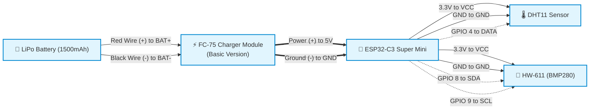

# ESP32-C3 Node-RED Weather Station

An ultra-low power, battery-operated IoT weather station based on the **ESP32-C3 Super Mini**. It reads temperature, humidity, and barometric pressure using DHT11 and HW-611 (BMP280) sensors, and pushes the data to a local Node-RED server via MQTT. 

Designed for longevity, this project utilizes aggressive Deep Sleep modes and hardware-level peripheral shutdown to maximize battery life on a 1500mAh LiPo battery.

## Hardware Required
- **ESP32-C3 Super Mini**
- **DHT11** Temperature/Humidity Sensor
- **HW-611 (BMP280)** Barometric Pressure Sensor
- **FC-75** (TP4056) Lithium Battery Charger Module
- **1500mAh LiPo Battery**

## Software Requirements
- Arduino IDE with ESP32 board definitions installed.
- **Board Selection:** `ESP32C3 Dev Module`
- **Libraries Required:**
  - `PubSubClient` by Nick O'Leary
  - `Adafruit Unified Sensor`
  - `Adafruit BMP280 Library`
  - `DHT sensor library` by Adafruit

## Circuit & Wiring Diagram

### ⚠️ Important Power Warning
Do NOT plug a USB-C cable into the ESP32 to flash code while the battery is attached to the 5V pin. Always unplug the battery connection to the ESP32 first. To charge the battery, plug your USB charger into the FC-75 module.

## Node-RED "Dead Man's Switch" Alert
Because the ESP32-C3 is wired in parallel without an active voltage reader, battery alerts are handled server-side.
Set up a Node-RED `Trigger Node` listening to the MQTT topic. Have it wait 25 minutes. If no MQTT messages arrive within 25 minutes (meaning the ESP32 battery died and it stopped waking up), have the trigger node send an HTTP POST to a Discord Webhook.
